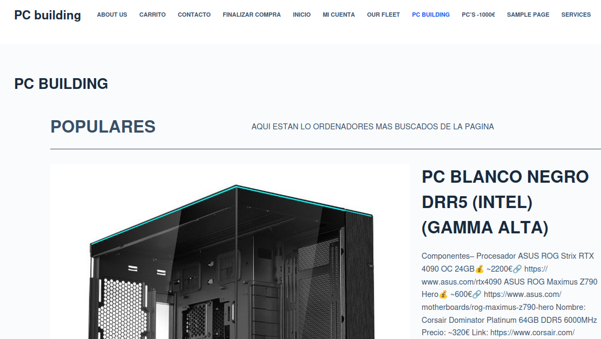
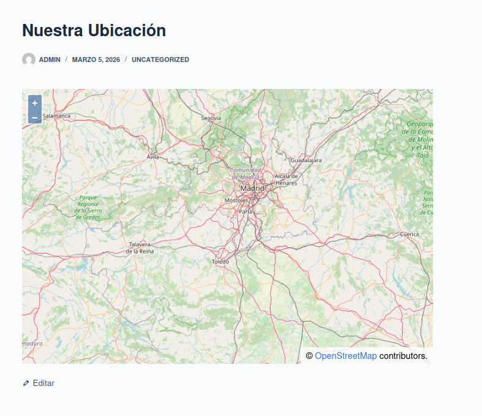
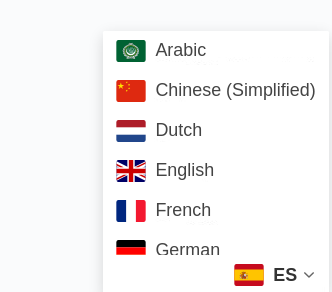
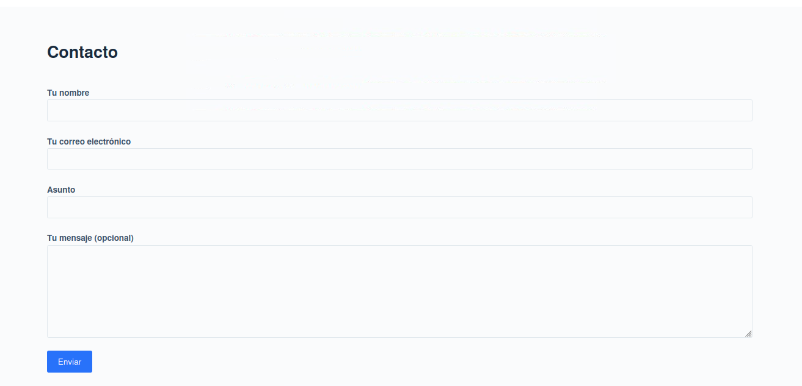

# PRACTICA3-AITORH-PAGINAWEB-WORDPRESS

## Descripción del proyecto

Para realizar este proyecto he desarrollado una página web para para que mis clientes compren diferentes builds de ordenadores de sobremesa. La Web creada se llama **“PC Building”**, utilizando **WordPress**. El objetivo principal era crear un sitio web funcional donde se puedan publicar, organizar y consultar  cosas relacionadas con componentes de ordenador.

## Instalación y configuración

En primer lugar, instalé **LAMP** y luego instalé **Wordpress**. Después seleccioné un tema visual adecuado. que permite mostrar la información de forma clara y atractiva.

Posteriormente personalicé el diseño del portal modificando diferentes elementos como el menú de navegación, los colores principales, la estructura de la página de inicio y las distintas secciones de la web para mejorar la experiencia de los usuarios.

## Organización del contenido

A continuación, creé varias **categorías** para organizar correctamente. Algunas de estas categorías incluyen:

- Tipo de CPU
- Rango de precios

También publiqué varios posts sobre diferentes combinaciones de componentes junto a su precio y su link de compra.

## Configuración del sitio

Durante el desarrollo también configuré algunos elementos importantes del sitio web:

- El menú principal de navegación  
- La página de inicio  
- La creación y publicación de entradas  
- La gestión del contenido desde el panel de administración de WordPress  

## Pruebas finales
# Explicacion del Portal

*Esta pagina web consiste en ayudar personas a elegir los mejores componentes para un ordenador, ya sea de gama baja o gama alta. Esta pagina nació con la idea de ayudar a personas a demostrar diferentes combinaciones de componentes para hacer un ordenador funcional.

## Ubicaciión
*En el apartado de Nuestra Ubicación esta la ubicación de donde estan nuestros almacenes, donde guardamos todos los componentes del ordenador*

## Contactos y Traductor
*Implemnté un Traducotr en esta pagina para que sea accessible para todas las personas, y también un apartado de contactos, donde la gente podria pedir ayuda si tienen algún problema*

